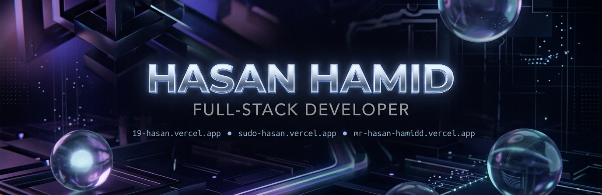
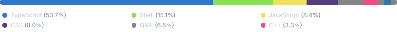

  

  

---

<h3 align="center">🌐 Social Connects &amp; Live Portfolios:</h3>

  
  
  
   
  
  
  

<h3 align="center">💻 Deep Dive Tech Stack:</h3>

| Category | Badges / Stack |
| :--- | :--- |
| **Frontend & 3D Web** |                |
| **Backend & Databases** |             |
| **Linux, DevOps & Host** |                |
| **Creative Assets** |      |

---

<h3 align="center">📊 Language Profile:</h3>

  

---

<h3 align="center">🚀 Top Projects Showcase:</h3>

<!-- START_SECTION:repos -->
<table width="100%" style="border-collapse: collapse; border: none;">
  <tr style="border: none;">
    <td width="50%" valign="top" style="border: 1px solid #21262d; border-radius: 6px; padding: 15px; background: #0d1117;">
      <h3 style="margin-top: 0; margin-bottom: 8px;"><a href="https://github.com/Mr-Hasan-Hamid/Arch-Hyprlands" style="text-decoration: none; color: #58a6ff;">📁 Arch-Hyprlands</a></h3>
      
For automated installation of Hyprland on Arch Linux or any Arch Linux-based distros

      

        
          <circle cx="6" cy="6" r="4" fill="#89e051" style="display: inline-block; width: 8px; height: 8px; border-radius: 50%; background-color: #89e051; margin-right: 4px;"></circle>Shell
        
        ⭐ 2
        🍴 0
      

    </td>
    <td width="50%" valign="top" style="border: 1px solid #21262d; border-radius: 6px; padding: 15px; background: #0d1117;">
      <h3 style="margin-top: 0; margin-bottom: 8px;"><a href="https://github.com/Mr-Hasan-Hamid/X-Invoice-Template" style="text-decoration: none; color: #58a6ff;">📁 X-Invoice-Template</a></h3>
      
No description provided.

      

        
          <circle cx="6" cy="6" r="4" fill="#f1e05a" style="display: inline-block; width: 8px; height: 8px; border-radius: 50%; background-color: #f1e05a; margin-right: 4px;"></circle>JavaScript
        
        ⭐ 0
        🍴 0
      

    </td>
  </tr>
  <tr style="border: none;">
    <td width="50%" valign="top" style="border: 1px solid #21262d; border-radius: 6px; padding: 15px; background: #0d1117;">
      <h3 style="margin-top: 0; margin-bottom: 8px;"><a href="https://github.com/Mr-Hasan-Hamid/bootanimdeck" style="text-decoration: none; color: #58a6ff;">📁 bootanimdeck</a></h3>
      
No description provided.

      

        
          <circle cx="6" cy="6" r="4" fill="#3178c6" style="display: inline-block; width: 8px; height: 8px; border-radius: 50%; background-color: #3178c6; margin-right: 4px;"></circle>TypeScript
        
        ⭐ 0
        🍴 0
      

    </td>
    <td width="50%" valign="top" style="border: 1px solid #21262d; border-radius: 6px; padding: 15px; background: #0d1117;">
      <h3 style="margin-top: 0; margin-bottom: 8px;"><a href="https://github.com/Mr-Hasan-Hamid/Mr-Hasan-Hamid" style="text-decoration: none; color: #58a6ff;">📁 Mr-Hasan-Hamid</a></h3>
      
No description provided.

      

        
          <circle cx="6" cy="6" r="4" fill="#3572a5" style="display: inline-block; width: 8px; height: 8px; border-radius: 50%; background-color: #3572a5; margin-right: 4px;"></circle>Python
        
        ⭐ 0
        🍴 0
      

    </td>
  </tr>
  <tr style="border: none;">
    <td width="50%" valign="top" style="border: 1px solid #21262d; border-radius: 6px; padding: 15px; background: #0d1117;">
      <h3 style="margin-top: 0; margin-bottom: 8px;"><a href="https://github.com/Mr-Hasan-Hamid/hasan-20" style="text-decoration: none; color: #58a6ff;">📁 hasan-20</a></h3>
      
No description provided.

      

        
          <circle cx="6" cy="6" r="4" fill="#858585" style="display: inline-block; width: 8px; height: 8px; border-radius: 50%; background-color: #858585; margin-right: 4px;"></circle>Other
        
        ⭐ 0
        🍴 0
      

    </td>
    <td width="50%" style="border: none; background: transparent;"></td>
  </tr>
</table>
<!-- END_SECTION:repos -->

---

### ⚡ Recent Activity:
<!-- START_SECTION:activity -->
<ul>
<li>📝 Committed to <a href="https://github.com/Mr-Hasan-Hamid/bootanimdeck"><b>bootanimdeck</b></a>: <a href="https://github.com/Mr-Hasan-Hamid/bootanimdeck/commit/73f82227dea6b7120939bc49105062038d238368"><code>73f8222</code></a> <i>"feat: use custom ResolutionDropdown in bulk downloader and playback drawer"</i> (11 days ago)</li>
<li>📝 Committed to <a href="https://github.com/Mr-Hasan-Hamid/bootanimdeck"><b>bootanimdeck</b></a>: <a href="https://github.com/Mr-Hasan-Hamid/bootanimdeck/commit/af6a0e8ba44986b2da7de814630749162f18a5a2"><code>af6a0e8</code></a> <i>"feat: add client-side bootanimation ZIP resolution resizing"</i> (11 days ago)</li>
<li>📝 Committed to <a href="https://github.com/Mr-Hasan-Hamid/bootanimdeck"><b>bootanimdeck</b></a>: <a href="https://github.com/Mr-Hasan-Hamid/bootanimdeck/commit/21bf1152ef2eb45deb883895c3f33bd6e441dcb3"><code>21bf115</code></a> <i>"fix: restore absolute Cloudflare R2 CDN URLs in animations.json"</i> (11 days ago)</li>
<li>📝 Committed to <a href="https://github.com/Mr-Hasan-Hamid/bootanimdeck"><b>bootanimdeck</b></a>: <a href="https://github.com/Mr-Hasan-Hamid/bootanimdeck/commit/464019db9faf5310d93448818e830de79d0709ce"><code>464019d</code></a> <i>"fix: remove unused parameter to fix ESLint build error"</i> (11 days ago)</li>
<li>📝 Committed to <a href="https://github.com/Mr-Hasan-Hamid/bootanimdeck"><b>bootanimdeck</b></a>: <a href="https://github.com/Mr-Hasan-Hamid/bootanimdeck/commit/060d3af7df96f45d26202b47001ecf489fef52bb"><code>060d3af</code></a> <i>"fix: remove broken middleware redirect causing 404 on all pages"</i> (11 days ago)</li>
</ul>
<!-- END_SECTION:activity -->

---

### 📊 GitHub Activity Statistics:

  
  

  

  

---

  

